# 📊 Diagramas Mermaid - Todos os Agentes BMAD

Este documento contém diagramas Mermaid detalhados para cada um dos 18 agentes do sistema BMAD.

---

## 1. 🛡️ SupervisorAgent

**Responsabilidade:** Monitora e valida todas as ações em cada etapa do fluxo BMAD

```mermaid
flowchart TD
    Start([SupervisorAgent]) --> ValidateInitial[validateInitial<br/>Validação Inicial]
    
    ValidateInitial --> CheckText{Texto<br/>válido?}
    CheckText -->|Não| Reject1[❌ Rejeitado:<br/>Texto vazio/inválido]
    CheckText -->|Sim| CheckLength{Tamanho<br/>> 1000?}
    CheckLength -->|Sim| Reject2[❌ Rejeitado:<br/>Texto muito longo]
    CheckLength -->|Não| Approve1[✅ Aprovado:<br/>qualityScore: 100]
    
    Start --> ValidateIntent[validateIntent<br/>Validação de Intenção]
    ValidateIntent --> CheckIntent{Intent<br/>presente?}
    CheckIntent -->|Não| Reject3[❌ Rejeitado:<br/>Intent não identificado]
    CheckIntent -->|Sim| CheckConfidence{Confiança<br/>>= 0.5?}
    CheckConfidence -->|Não| Reject4[❌ Rejeitado:<br/>Confiança baixa]
    CheckConfidence -->|Sim| Approve2[✅ Aprovado:<br/>qualityScore: confidence * 100]
    
    Start --> ValidatePermission[validatePermission<br/>Validação de Permissão]
    ValidatePermission --> CheckPermission{Resultado<br/>válido?}
    CheckPermission -->|Não| Reject5[❌ Rejeitado:<br/>Resultado inválido]
    CheckPermission -->|Sim| CheckAllowed{Permissão<br/>concedida?}
    CheckAllowed -->|Não| Reject6[❌ Rejeitado:<br/>Permissão negada]
    CheckAllowed -->|Sim| Approve3[✅ Aprovado:<br/>qualityScore: 100]
    
    Start --> ValidateContext[validateContext<br/>Validação de Contexto]
    ValidateContext --> CheckContext{Contexto<br/>presente?}
    CheckContext -->|Não| Reject7[❌ Rejeitado:<br/>Contexto não coletado]
    CheckContext -->|Sim| CheckData{Tem dados<br/>mínimos?}
    CheckData -->|Não| Approve4[⚠️ Aprovado com avisos:<br/>qualityScore: 40]
    CheckData -->|Sim| Approve5[✅ Aprovado:<br/>qualityScore: 80]
    
    Start --> ValidateQueryResult[validateQueryResult<br/>Validação de Query]
    ValidateQueryResult --> CheckQuery{Resultado<br/>presente?}
    CheckQuery -->|Não| Reject8[❌ Rejeitado:<br/>Resultado vazio]
    CheckQuery -->|Sim| CheckError{Tem<br/>erro?}
    CheckError -->|Sim| Reject9[❌ Rejeitado:<br/>Erro no resultado]
    CheckError -->|Não| CheckCount{É contagem?}
    CheckCount -->|Sim| Approve6[✅ Aprovado:<br/>qualityScore: 90]
    CheckCount -->|Não| CheckResults{Tem resultados<br/>ou summary?}
    CheckResults -->|Sim| Approve7[✅ Aprovado:<br/>qualityScore: 70-90]
    CheckResults -->|Não| Approve8[⚠️ Aprovado:<br/>qualityScore: 50]
    
    Start --> ValidateActionResult[validateActionResult<br/>Validação de Ação]
    ValidateActionResult --> CheckAction{Resultado<br/>presente?}
    CheckAction -->|Não| Reject10[❌ Rejeitado:<br/>Resultado vazio]
    CheckAction -->|Sim| CheckActionError{Tem<br/>erro?}
    CheckActionError -->|Sim| Reject11[❌ Rejeitado:<br/>Erro no resultado]
    CheckActionError -->|Não| CheckSuccess{Success<br/>= true?}
    CheckSuccess -->|Sim| Approve9[✅ Aprovado:<br/>qualityScore: 90]
    CheckSuccess -->|Não| Approve10[⚠️ Aprovado:<br/>qualityScore: 50]
    
    Start --> ValidateVisualizations[validateVisualizations<br/>Validação de Visualizações]
    ValidateVisualizations --> CheckVizArray{É array<br/>válido?}
    CheckVizArray -->|Não| Reject12[❌ Rejeitado:<br/>Formato inválido]
    CheckVizArray -->|Sim| CheckVizStructure{Todas têm<br/>estrutura válida?}
    CheckVizStructure -->|Não| Approve11[⚠️ Aprovado:<br/>qualityScore: 40]
    CheckVizStructure -->|Sim| Approve12[✅ Aprovado:<br/>qualityScore: 85]
    
    Start --> ValidateFinal[validateFinal<br/>Validação Final]
    ValidateFinal --> CalcRelevance[calculateRelevance<br/>Calcula Relevância]
    CalcRelevance --> CalcCompleteness[calculateCompleteness<br/>Calcula Completude]
    CalcCompleteness --> CheckQuality{QualityScore<br/>>= threshold?}
    CheckQuality -->|Não| AttemptCorrection[attemptCorrection<br/>Tenta Correção]
    AttemptCorrection --> Reject13[❌ Rejeitado:<br/>Correção falhou]
    CheckQuality -->|Sim| Approve13[✅ Aprovado:<br/>Validação final OK]
    
    style Start fill:#fff3cd
    style Approve1 fill:#d4edda
    style Approve2 fill:#d4edda
    style Approve3 fill:#d4edda
    style Approve4 fill:#fff3cd
    style Approve5 fill:#d4edda
    style Approve6 fill:#d4edda
    style Approve7 fill:#d4edda
    style Approve8 fill:#fff3cd
    style Approve9 fill:#d4edda
    style Approve10 fill:#fff3cd
    style Approve11 fill:#fff3cd
    style Approve12 fill:#d4edda
    style Approve13 fill:#d4edda
    style Reject1 fill:#f8d7da
    style Reject2 fill:#f8d7da
    style Reject3 fill:#f8d7da
    style Reject4 fill:#f8d7da
    style Reject5 fill:#f8d7da
    style Reject6 fill:#f8d7da
    style Reject7 fill:#f8d7da
    style Reject8 fill:#f8d7da
    style Reject9 fill:#f8d7da
    style Reject10 fill:#f8d7da
    style Reject11 fill:#f8d7da
    style Reject12 fill:#f8d7da
    style Reject13 fill:#f8d7da
```

---

## 2. 🎤 VoiceIntentAgent

**Responsabilidade:** Classifica a intenção do usuário e extrai parâmetros do comando

```mermaid
flowchart TD
    Start([VoiceIntentAgent]) --> ClassifyIntent[classifyIntent<br/>Classifica Intenção]
    
    ClassifyIntent --> Normalize[Normalizar texto<br/>para lowercase]
    Normalize --> CheckTemporal{Comparação<br/>temporal?}
    
    CheckTemporal -->|Sim| TemporalIntent[✅ Intent: query_database<br/>confidence: 0.95]
    
    CheckTemporal -->|Não| CheckCompaniesWithout{Empresas sem<br/>colaboradores?}
    CheckCompaniesWithout -->|Sim| CompaniesIntent[✅ Intent: query_database<br/>confidence: 0.95]
    
    CheckCompaniesWithout -->|Não| CheckQueryKeywords{Palavras-chave<br/>de query?}
    CheckQueryKeywords -->|Sim| QueryIntent[✅ Intent: query_database<br/>confidence: 0.9]
    
    CheckQueryKeywords -->|Não| MatchPatterns[Buscar padrões<br/>de intenção]
    MatchPatterns --> FoundPattern{Padrão<br/>encontrado?}
    FoundPattern -->|Sim| PatternIntent[✅ Intent encontrado<br/>confidence: 0.8]
    
    FoundPattern -->|Não| Fallback[⚠️ Fallback:<br/>query_database<br/>confidence: 0.6]
    
    TemporalIntent --> ExtractParams
    CompaniesIntent --> ExtractParams
    QueryIntent --> ExtractParams
    PatternIntent --> ExtractParams
    Fallback --> ExtractParams
    
    ExtractParams[extractParams<br/>Extrai Parâmetros] --> ExtractCNPJ[Extrair CNPJ<br/>regex: \d{2}\.?\d{3}\.?\d{3}\/?\d{4}-?\d{2}]
    ExtractCNPJ --> ExtractCPF[Extrair CPF<br/>regex: \d{3}\.?\d{3}\.?\d{3}-?\d{2}]
    ExtractCPF --> ExtractID[Extrair ID<br/>regex: id:?\s*(\w+)]
    ExtractID --> ExtractName[Extrair Nome<br/>após palavras-chave]
    ExtractName --> ExtractEmail[Extrair Email<br/>regex: email padrão]
    
    ExtractEmail --> ReturnResult[📤 Retorna Resultado:<br/>intent, params, confidence]
    
    style Start fill:#e1f5ff
    style TemporalIntent fill:#d4edda
    style CompaniesIntent fill:#d4edda
    style QueryIntent fill:#d4edda
    style PatternIntent fill:#d4edda
    style Fallback fill:#fff3cd
    style ReturnResult fill:#d4edda
```

---

## 3. 🔐 PermissionAgent

**Responsabilidade:** Verifica se o usuário tem permissão para executar a ação

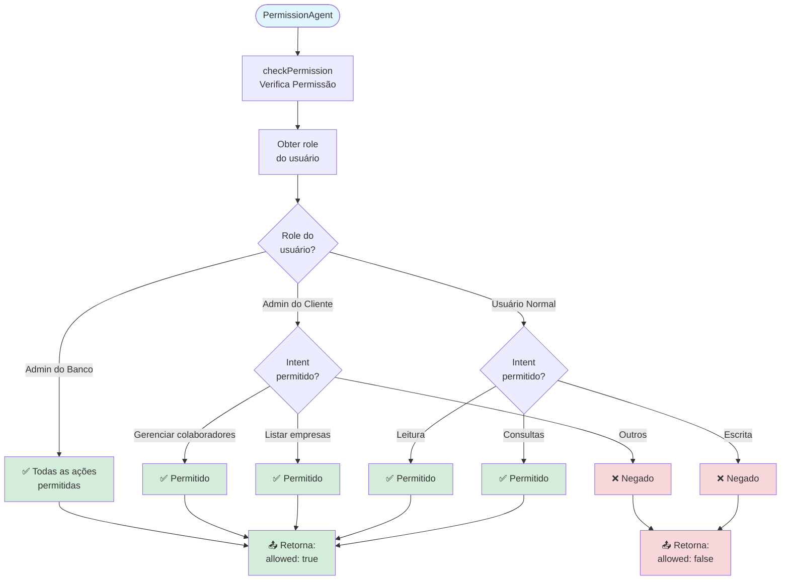

---

## 4. 📦 ContextAgent

**Responsabilidade:** Coleta contexto do usuário, página e dados relevantes

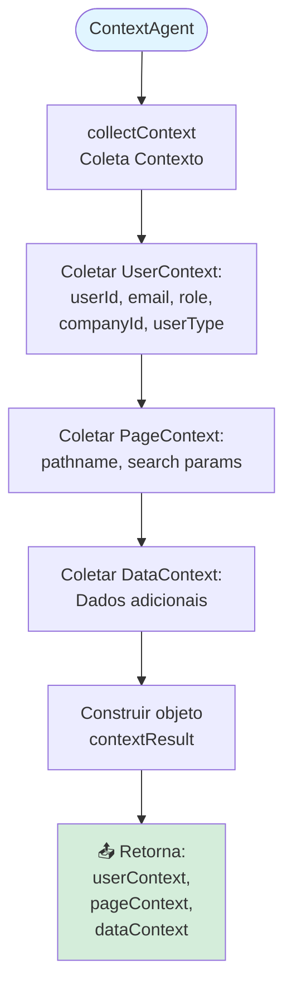

---

## 5. 🧠 DatabaseKnowledgeAgent

**Responsabilidade:** Conhece o schema do banco, tecnologias e como operar

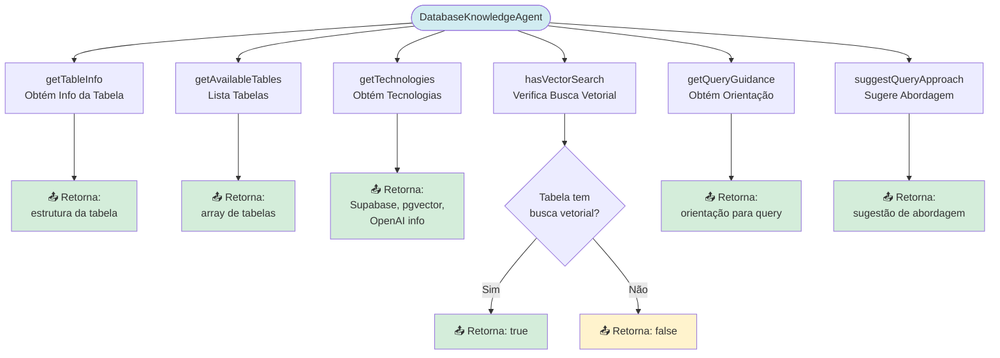

---

## 6. 🧠 QueryPlanningAgent

**Responsabilidade:** Usa IA (OpenAI) para planejar consultas dinâmicas no banco

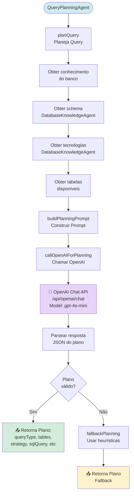

---

## 7. 🔍 DatabaseQueryAgent

**Responsabilidade:** Executa consultas ao banco de dados (SQL, busca semântica, agregações)

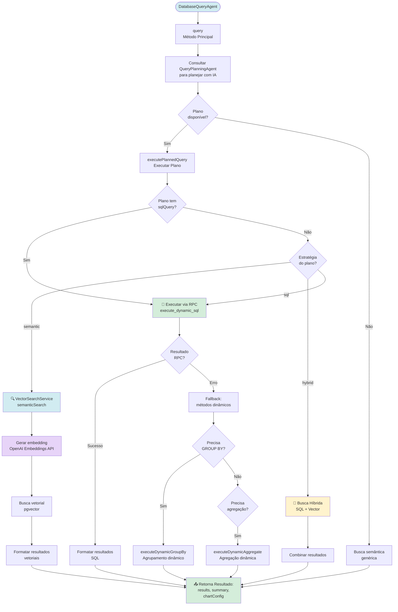

---

## 8. 🏢 CompanyActionAgent

**Responsabilidade:** Gerencia ações relacionadas a empresas

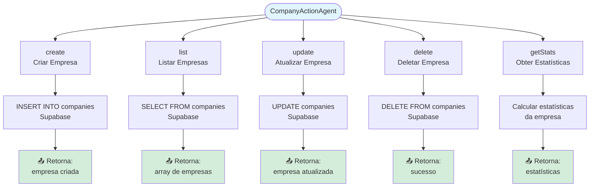

---

## 9. 👥 EmployeeActionAgent

**Responsabilidade:** Gerencia ações relacionadas a colaboradores

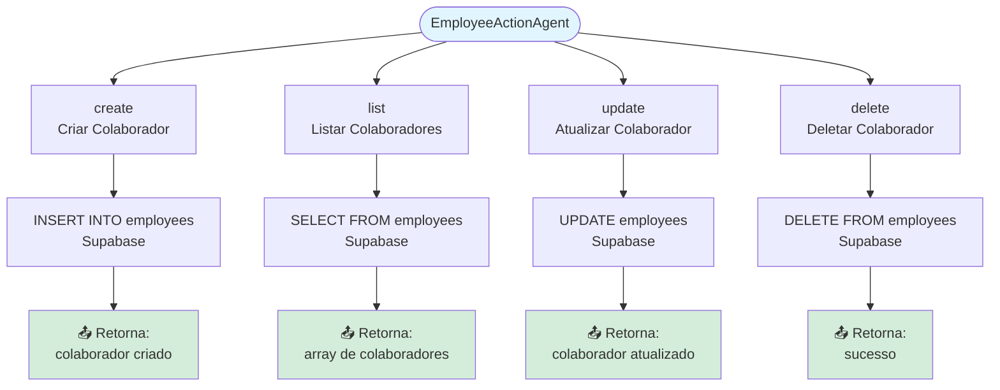

---

## 10. 📢 CampaignActionAgent

**Responsabilidade:** Gerencia ações relacionadas a campanhas de marketing

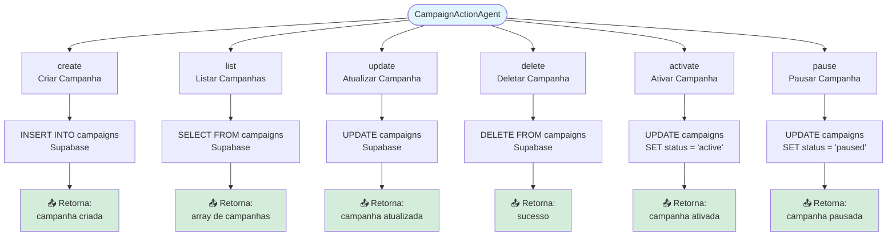

---

## 11. 🎯 ProspectingActionAgent

**Responsabilidade:** Gerencia ações relacionadas a prospecção de clientes

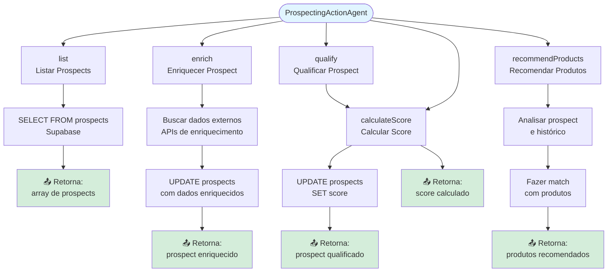

---

## 12. 💰 BenefitActionAgent

**Responsabilidade:** Gerencia ações relacionadas a benefícios

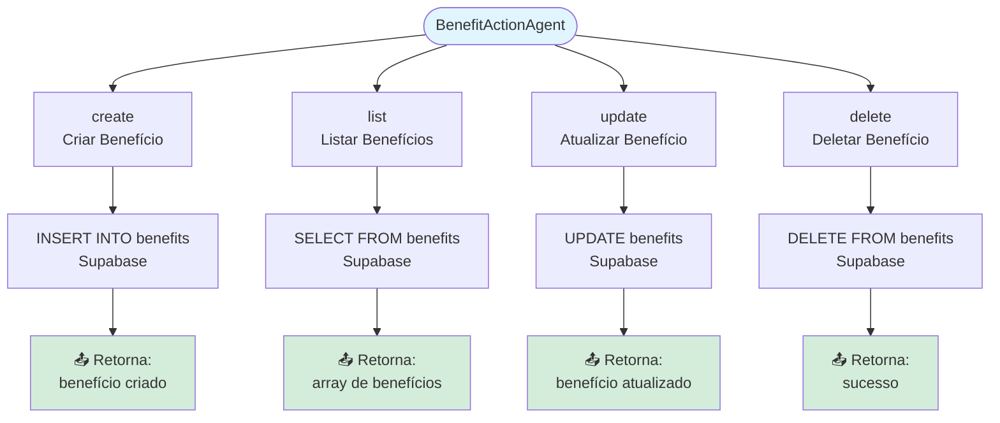

---

## 13. 📦 ProductActionAgent

**Responsabilidade:** Gerencia ações relacionadas a produtos financeiros

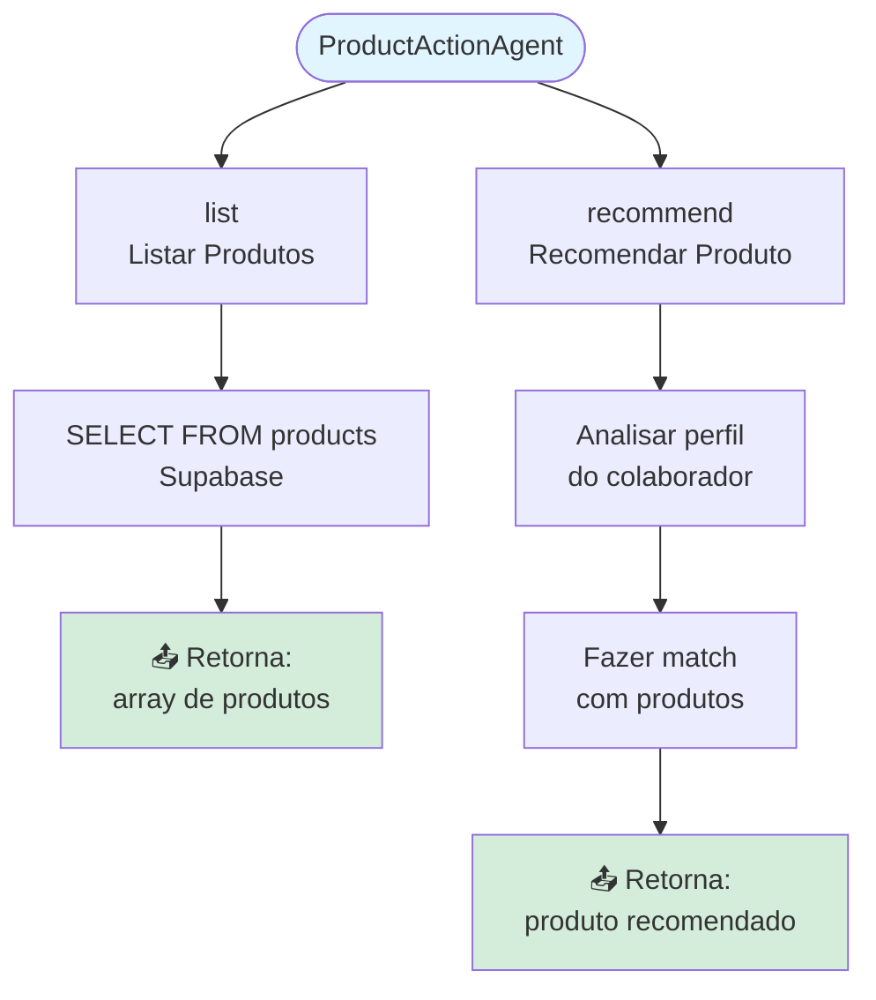

---

## 14. 🔌 IntegrationActionAgent

**Responsabilidade:** Gerencia ações relacionadas a integrações externas

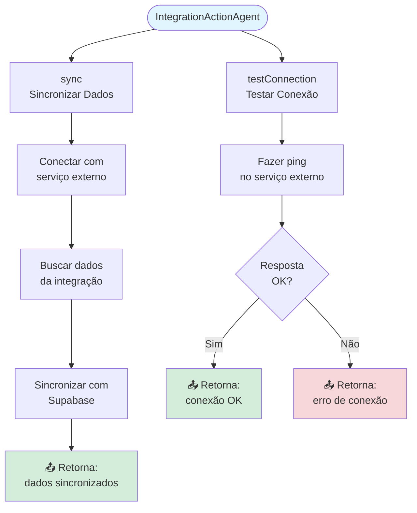

---

## 15. 📊 DataVisualizationAgent

**Responsabilidade:** Gera visualizações de dados (gráficos, tabelas, cards)

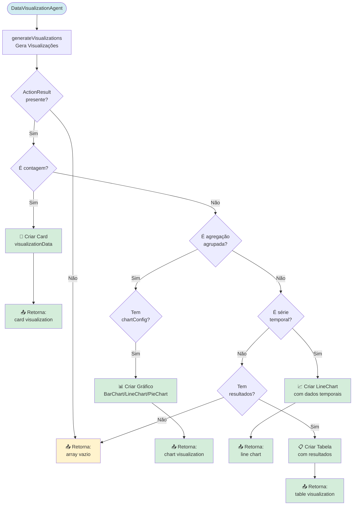

---

## 16. 💬 FeedbackAgent

**Responsabilidade:** Gera resposta textual para o usuário usando IA

```mermaid
flowchart TD
    Start([FeedbackAgent]) --> GenerateFeedback[generateFeedback<br/>Gera Feedback]
    
    GenerateFeedback --> CheckSuccess{ActionResult<br/>sucesso?}
    CheckSuccess -->|Não| ReturnError[📤 Retorna:<br/>feedback de erro]
    
    CheckSuccess -->|Sim| CheckIntent{Tipo de<br/>Intent?}
    
    CheckIntent -->|query_database| GenerateInterpreted[generateInterpretedResponse<br/>Gerar Resposta Interpretada]
    GenerateInterpreted --> BuildPrompt[Construir prompt<br/>com pergunta e dados]
    BuildPrompt --> CallOpenAI[🤖 OpenAI Chat API<br/>/api/openai/chat<br/>Model: gpt-4o-mini]
    CallOpenAI --> ParseResponse[Parsear resposta<br/>interpretada]
    ParseResponse --> ReturnInterpreted[📤 Retorna:<br/>resposta interpretada]
    
    CheckIntent -->|create_*| CreateMessage[Gerar mensagem:<br/>"X criado com sucesso!"]
    CreateMessage --> ReturnCreate[📤 Retorna:<br/>mensagem de criação]
    
    CheckIntent -->|list_*| ListMessage[Gerar mensagem:<br/>"Encontrei N X"]
    ListMessage --> ReturnList[📤 Retorna:<br/>mensagem de listagem]
    
    CheckIntent -->|update_*| UpdateMessage[Gerar mensagem:<br/>"X atualizado com sucesso!"]
    UpdateMessage --> ReturnUpdate[📤 Retorna:<br/>mensagem de atualização]
    
    CheckIntent -->|delete_*| DeleteMessage[Gerar mensagem:<br/>"X removido com sucesso!"]
    DeleteMessage --> ReturnDelete[📤 Retorna:<br/>mensagem de remoção]
    
    CheckIntent -->|other| GenericMessage[Gerar mensagem:<br/>"Ação executada com sucesso!"]
    GenericMessage --> ReturnGeneric[📤 Retorna:<br/>mensagem genérica]
    
    ReturnInterpreted --> AddVoiceConfig[Adicionar voiceConfig:<br/>speed, pitch]
    ReturnCreate --> AddVoiceConfig
    ReturnList --> AddVoiceConfig
    ReturnUpdate --> AddVoiceConfig
    ReturnDelete --> AddVoiceConfig
    ReturnGeneric --> AddVoiceConfig
    
    AddVoiceConfig --> ReturnFinal[📤 Retorna Feedback Final:<br/>text, voiceConfig,<br/>visualizations]
    
    style Start fill:#d1ecf1
    style CallOpenAI fill:#e7d4f8
    style ReturnInterpreted fill:#d4edda
    style ReturnCreate fill:#d4edda
    style ReturnList fill:#d4edda
    style ReturnUpdate fill:#d4edda
    style ReturnDelete fill:#d4edda
    style ReturnGeneric fill:#d4edda
    style ReturnFinal fill:#d4edda
    style ReturnError fill:#f8d7da
```

---

## 17. 💡 SuggestionAgent

**Responsabilidade:** Gera sugestões de próximas ações baseadas no contexto

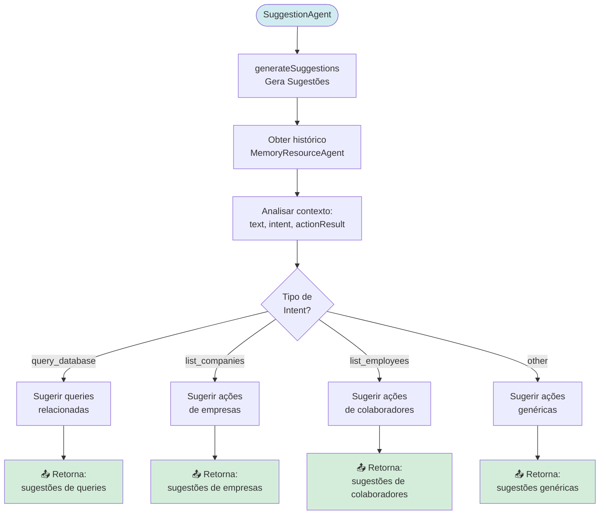

---

## 18. 🧠 MemoryResourceAgent

**Responsabilidade:** Monitora e otimiza memória e histórico de conversação

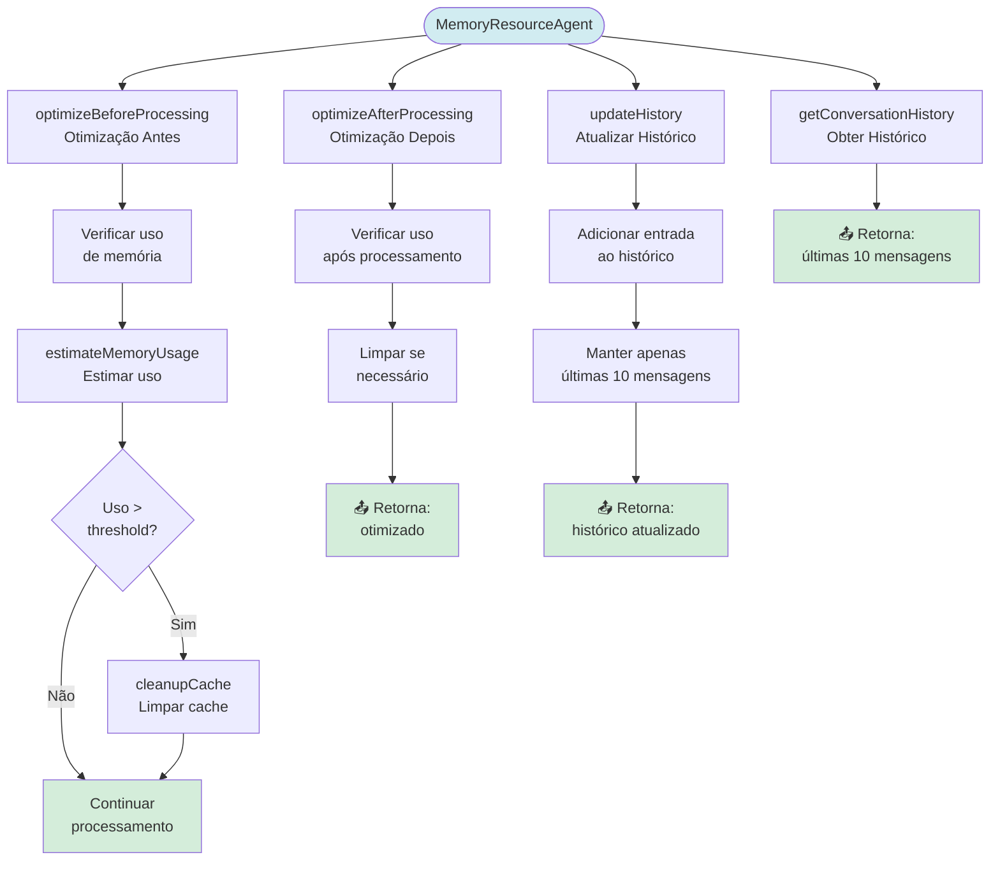

---

## 📊 Resumo dos Agentes

| # | Agente | Responsabilidade Principal | Interações com IA |
|---|--------|---------------------------|-------------------|
| 1 | SupervisorAgent | Validação e monitoramento | ❌ |
| 2 | VoiceIntentAgent | Classificação de intenções | ❌ |
| 3 | PermissionAgent | Verificação de permissões | ❌ |
| 4 | ContextAgent | Coleta de contexto | ❌ |
| 5 | DatabaseKnowledgeAgent | Conhecimento do banco | ❌ |
| 6 | QueryPlanningAgent | Planejamento de queries | ✅ OpenAI Chat |
| 7 | DatabaseQueryAgent | Execução de queries | ❌ |
| 8 | CompanyActionAgent | Gestão de empresas | ❌ |
| 9 | EmployeeActionAgent | Gestão de colaboradores | ❌ |
| 10 | CampaignActionAgent | Gestão de campanhas | ❌ |
| 11 | ProspectingActionAgent | Prospecção de clientes | ❌ |
| 12 | BenefitActionAgent | Gestão de benefícios | ❌ |
| 13 | ProductActionAgent | Produtos financeiros | ❌ |
| 14 | IntegrationActionAgent | Integrações externas | ❌ |
| 15 | DataVisualizationAgent | Geração de visualizações | ❌ |
| 16 | FeedbackAgent | Geração de feedback | ✅ OpenAI Chat |
| 17 | SuggestionAgent | Geração de sugestões | ❌ |
| 18 | MemoryResourceAgent | Gerenciamento de memória | ❌ |

---

**Última atualização:** 2024  
**Versão do Sistema:** BMAD v1.0

