# Fluxo Completo do Especialista NEX/FLX/AGX/OPX/ORDX

## Diagrama de Fluxo

```mermaid
flowchart TD
    Start([Usuário fala com o Especialista]) --> AudioCapture[🎤 Captura de Áudio<br/>AudioRecorder]
    
    AudioCapture --> AudioProcess[📦 Processamento de Áudio<br/>Blob de áudio gerado]
    
    AudioProcess --> Whisper[🤖 Transcrição Whisper<br/>OpenAI Whisper API]
    
    Whisper --> Transcription{Transcrição<br/>válida?}
    
    Transcription -->|Não| Start
    Transcription -->|Sim| Orchestrator[🚀 NEX Orchestrator<br/>Inicia Processamento]
    
    Orchestrator --> Step1[📋 Step 1/12: Validação Inicial<br/>SupervisorAgent.validateInitial]
    
    Step1 --> Step1Check{Validação<br/>aprovada?}
    Step1Check -->|Não| Error1[❌ Erro: Comando inválido]
    Step1Check -->|Sim| Step2[📋 Step 2/12: Classificação de Intenção<br/>VoiceIntentAgent.classifyIntent]
    
    Step2 --> Step2Result[Intent detectado:<br/>query_database, list_companies, etc.]
    
    Step2Result --> Step3[📋 Step 3/12: Verificação de Permissões<br/>PermissionAgent.checkPermission]
    
    Step3 --> Step3Check{Permissão<br/>concedida?}
    Step3Check -->|Não| Error2[❌ Erro: Sem permissão]
    Step3Check -->|Sim| Step4[📋 Step 4/12: Coleta de Contexto<br/>ContextAgent.collectContext]
    
    Step4 --> Step5[📋 Step 5/12: Otimização de Memória<br/>MemoryResourceAgent.optimizeBefore]
    
    Step5 --> Step6[📋 Step 6/12: Execução de Ação]
    
    Step6 --> ActionType{Type de<br/>Intent?}
    
    ActionType -->|query_database| QueryFlow[🔍 DatabaseQueryAgent]
    ActionType -->|list_companies| CompanyFlow[🏢 CompanyActionAgent]
    ActionType -->|list_employees| EmployeeFlow[👥 EmployeeActionAgent]
    ActionType -->|other| OtherFlow[⚙️ Outros ActionAgents]
    
    QueryFlow --> QueryPlanning[🧠 QueryPlanningAgent<br/>Planeja query com IA]
    
    QueryPlanning --> PlanningResult{Plano<br/>gerado?}
    
    PlanningResult -->|Sim| ExecuteQuery[📊 Executa Query]
    PlanningResult -->|Não| Fallback[⚠️ Fallback: Busca semântica]
    
    ExecuteQuery --> QueryType{Tipo de<br/>Query?}
    
    QueryType -->|SQL Query| RPC[🔧 Executa via RPC<br/>execute_dynamic_sql]
    QueryType -->|Semantic| VectorSearch[🔍 VectorSearchService<br/>Busca semântica]
    QueryType -->|Hybrid| Hybrid[🔀 Combina SQL + Vector]
    
    RPC --> RPCResult{Resultado<br/>RPC?}
    RPCResult -->|Erro| Fallback
    RPCResult -->|Sucesso| QueryResults[✅ Resultados da Query]
    
    VectorSearch --> VectorResults[✅ Resultados Vetoriais]
    Hybrid --> HybridResults[✅ Resultados Híbridos]
    
    QueryResults --> Step7
    VectorResults --> Step7
    HybridResults --> Step7
    Fallback --> Step7
    
    CompanyFlow --> CompanyResults[✅ Resultados de Empresas]
    EmployeeFlow --> EmployeeResults[✅ Resultados de Funcionários]
    OtherFlow --> OtherResults[✅ Outros Resultados]
    
    CompanyResults --> Step7
    EmployeeResults --> Step7
    OtherResults --> Step7
    
    Step7[📋 Step 7/12: Geração de Visualizações<br/>DataVisualizationAgent.generateVisualizations]
    
    Step7 --> VizType{Tipo de<br/>Visualização?}
    
    VizType -->|Chart| ChartViz[📊 Gráfico<br/>BarChart, LineChart, PieChart]
    VizType -->|Table| TableViz[📋 Tabela]
    VizType -->|Card| CardViz[🎴 Card]
    
    ChartViz --> Step8
    TableViz --> Step8
    CardViz --> Step8
    
    Step8[📋 Step 8/12: Geração de Feedback<br/>FeedbackAgent.generateFeedback]
    
    Step8 --> FeedbackAI[🤖 OpenAI Chat API<br/>Gera resposta interpretada]
    
    FeedbackAI --> FeedbackResult[💬 Feedback Natural<br/>Resposta conversacional]
    
    FeedbackResult --> Step9[📋 Step 9/12: Otimização de Memória<br/>MemoryResourceAgent.optimizeAfter]
    
    Step9 --> Step10[📋 Step 10/12: Validação Final<br/>SupervisorAgent.validateFinal]
    
    Step10 --> Step10Check{Validação<br/>final OK?}
    
    Step10Check -->|Não| Step10Correction[⚠️ Tentativa de Correção<br/>SupervisorAgent.attemptCorrection]
    Step10Correction --> Step10Check
    Step10Check -->|Sim| Step11[📋 Step 11/12: Geração de Sugestões<br/>SuggestionAgent.generateSuggestions]
    
    Step11 --> Step12[📋 Step 12/12: Atualização de Histórico<br/>MemoryResourceAgent.updateHistory]
    
    Step12 --> FinalResult[✅ Resultado Final<br/>Feedback + Visualizações + Sugestões]
    
    FinalResult --> Avatar[🎥 Envio para Avatar<br/>HeyGen Streaming Avatar]
    
    Avatar --> TTS[🔊 Text-to-Speech<br/>Avatar fala a resposta]
    
    TTS --> Display[📺 Exibição na Interface<br/>- Histórico de comandos<br/>- Visualizações<br/>- Sugestões]
    
    Display --> End([✅ Processo Concluído])
    
    Error1 --> End
    Error2 --> End
    
    style Start fill:#e1f5ff
    style End fill:#d4edda
    style Error1 fill:#f8d7da
    style Error2 fill:#f8d7da
    style Orchestrator fill:#fff3cd
    style QueryPlanning fill:#d1ecf1
    style RPC fill:#d4edda
    style FeedbackAI fill:#d1ecf1
    style Avatar fill:#e7d4f8
    style TTS fill:#e7d4f8
```

## Agentes NEX/FLX/AGX/OPX/ORDX e Suas Responsabilidades

> 📖 **Para documentação completa do padrão, consulte**: [`PADRAO_NEX_FLX_AGX_OPX_ORDX.md`](./PADRAO_NEX_FLX_AGX_OPX_ORDX.md)

### 🔷 NEX (Nexus - Orquestração)

### 0. NEXOrchestrator (Orquestrador)
- **Orquestração Central**: Coordena todos os agentes
- **Gerenciamento de Fluxo**: Controla as 12 etapas do processamento
- **Conexão entre Agentes**: Facilita comunicação entre diferentes tipos

### 📐 ORDX (Ordo - Ordem, Workflow Estruturado)

### 1. SupervisorAgent (Validador)
- **Validação Inicial**: Verifica se o comando é válido
- **Validação de Intenção**: Verifica qualidade da classificação
- **Validação de Permissão**: Verifica se usuário tem permissão
- **Validação de Contexto**: Verifica qualidade do contexto coletado
- **Validação de Query Result**: Verifica qualidade dos resultados
- **Validação de Visualizações**: Verifica se visualizações são válidas
- **Validação Final**: Calcula relevância, completude e qualidade geral
- **Correção**: Tenta corrigir problemas detectados

### 3. PermissionAgent (Verificador de Permissões)
- **Verificação de Role**: Verifica role do usuário (admin, user, etc.)
- **Verificação de Permissão**: Verifica se usuário pode executar ação
- **Respeita RBAC**: Role-Based Access Control

### 4. ContextAgent (Coletor de Contexto)
- **Contexto do Usuário**: Coleta informações do usuário
- **Contexto da Página**: Coleta informações da página atual
- **Contexto de Dados**: Coleta dados relevantes do histórico

### 5. MemoryResourceAgent (Gerenciador de Memória)
- **Otimização Antes**: Limpa memória antes do processamento
- **Otimização Depois**: Limpa memória depois do processamento
- **Atualização de Histórico**: Atualiza histórico de conversação
- **Gerenciamento**: Gerencia tamanho do histórico

### 🌊 FLX (Fluxus - Fluxo Contínuo)

### 2. VoiceIntentAgent (Classificador)
- **Classificação de Intenção**: Detecta o tipo de ação desejada
- **Extração de Parâmetros**: Extrai parâmetros relevantes do comando
- **Intenções suportadas**: 
  - `query_database`: Consultas ao banco
  - `list_companies`: Listar empresas
  - `list_employees`: Listar funcionários
  - `create_company`: Criar empresa
  - E outras...

### 6. QueryPlanningAgent (Planejador de Queries)
- **Análise da Query**: Analisa pergunta do usuário
- **Geração de SQL**: Gera query SQL completa via OpenAI
- **Determinação de Estratégia**: Decide entre SQL, semantic ou hybrid
- **Plano Detalhado**: Gera plano com tabelas, campos, agregações, etc.

### 7. SuggestionAgent (Gerador de Sugestões)
- **Análise de Histórico**: Analisa histórico de conversação
- **Geração de Sugestões**: Gera sugestões de próximas ações
- **Relevância**: Ordena sugestões por relevância

### ⚡ AGX (Agens - Aquele que Age)

### 8. CompanyActionAgent
- **Ações de Empresas**: Criar, listar, atualizar, deletar empresas
- **Estatísticas**: Obter estatísticas de empresas

### 9. EmployeeActionAgent
- **Ações de Colaboradores**: Criar, listar, atualizar, deletar colaboradores

### 10. CampaignActionAgent
- **Ações de Campanhas**: Criar, listar, atualizar, deletar, ativar, pausar campanhas

### 11. ProspectingActionAgent
- **Ações de Prospecção**: Listar, enriquecer, qualificar prospects, calcular scores

### 12. BenefitActionAgent
- **Ações de Benefícios**: Criar, listar, atualizar, deletar benefícios

### 13. ProductActionAgent
- **Ações de Produtos**: Listar produtos, recomendar produtos

### 14. IntegrationActionAgent
- **Ações de Integrações**: Sincronizar dados, testar conexões

### 🔧 OPX (Opus - Obra, Execução, Trabalho)

### 15. DatabaseQueryAgent (Executor de Queries)
- **Planejamento**: Usa QueryPlanningAgent para planejar query
- **Execução SQL**: Executa queries SQL via RPC
- **Busca Semântica**: Executa buscas no vectorstore
- **Estratégia Híbrida**: Combina SQL + busca semântica
- **Formatação**: Formata resultados para visualização

### 16. DatabaseKnowledgeAgent (Conhecimento do Banco)
- **Schema do Banco**: Conhece estrutura das tabelas
- **Tecnologias**: Conhece tecnologias usadas (Supabase, pgvector, etc.)
- **Tabelas Disponíveis**: Lista tabelas disponíveis
- **Sugestões**: Sugere abordagens para queries

### 17. DataVisualizationAgent (Gerador de Visualizações)
- **Análise de Dados**: Analisa resultados para determinar tipo de visualização
- **Geração de Gráficos**: Gera gráficos (bar, line, pie)
- **Geração de Tabelas**: Gera tabelas quando apropriado
- **Geração de Cards**: Gera cards para contagens/agregados

### 18. FeedbackAgent (Gerador de Feedback)
- **Geração com IA**: Usa OpenAI Chat API para gerar resposta natural
- **Interpretação**: Interpreta dados e responde no contexto da pergunta
- **Formatação**: Formata resposta para TTS
- **Configuração de Voz**: Configura velocidade e pitch

### 19. VectorSearchService
- **Busca Semântica**: Realiza buscas usando embeddings vetoriais
- **Busca Híbrida**: Combina busca vetorial com SQL
- **Busca Cruzada**: Busca entre múltiplas tabelas

### 20. EmbeddingGenerator
- **Geração de Embeddings**: Gera embeddings usando OpenAI Embeddings API
- **Cache**: Gerencia cache de embeddings para otimização

## Fluxo de Dados

```mermaid
graph LR
    A[Comando de Voz] --> B[Transcrição]
    B --> C[Intent + Params]
    C --> D[Contexto]
    D --> E[Plano de Query]
    E --> F[Execução]
    F --> G[Resultados]
    G --> H[Visualizações]
    H --> I[Feedback]
    I --> J[Validação]
    J --> K[Avatar + TTS]
    
    style A fill:#e1f5ff
    style K fill:#d4edda
```

## Pontos de Validação

1. **Validação Inicial**: Comando não vazio, tamanho adequado
2. **Validação de Intenção**: Intent válido, confiança > threshold
3. **Validação de Permissão**: Usuário tem permissão para ação
4. **Validação de Contexto**: Contexto completo e válido
5. **Validação de Query Result**: Resultados válidos e não vazios
6. **Validação de Visualizações**: Visualizações válidas e formatadas
7. **Validação Final**: Relevância, completude e qualidade geral

## Tratamento de Erros

- **Erro na Transcrição**: Retorna ao início, aguarda novo comando
- **Erro na Validação**: Retorna erro específico ao usuário
- **Erro na Execução**: Tenta fallback (ex: SQL → Vector Search)
- **Erro na RPC**: Tenta métodos dinâmicos como fallback
- **Erro na Validação Final**: Tenta correção, se falhar retorna resultado parcial

## Tecnologias Utilizadas

- **Whisper API**: Transcrição de voz para texto
- **OpenAI GPT-4o-mini**: Planejamento de queries e geração de feedback
- **OpenAI Embeddings**: Geração de embeddings para busca semântica
- **Supabase**: Banco de dados PostgreSQL com RLS
- **pgvector**: Busca vetorial com HNSW
- **HeyGen Streaming Avatar**: Avatar de vídeo com TTS
- **React Joyride**: Tour guiado

